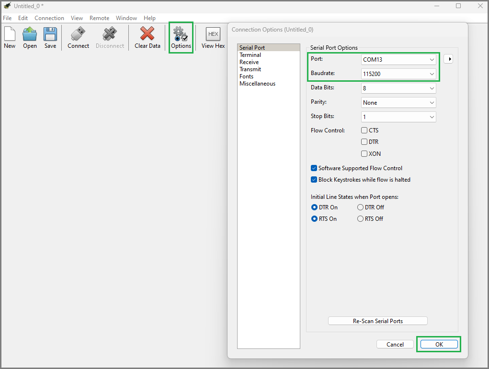
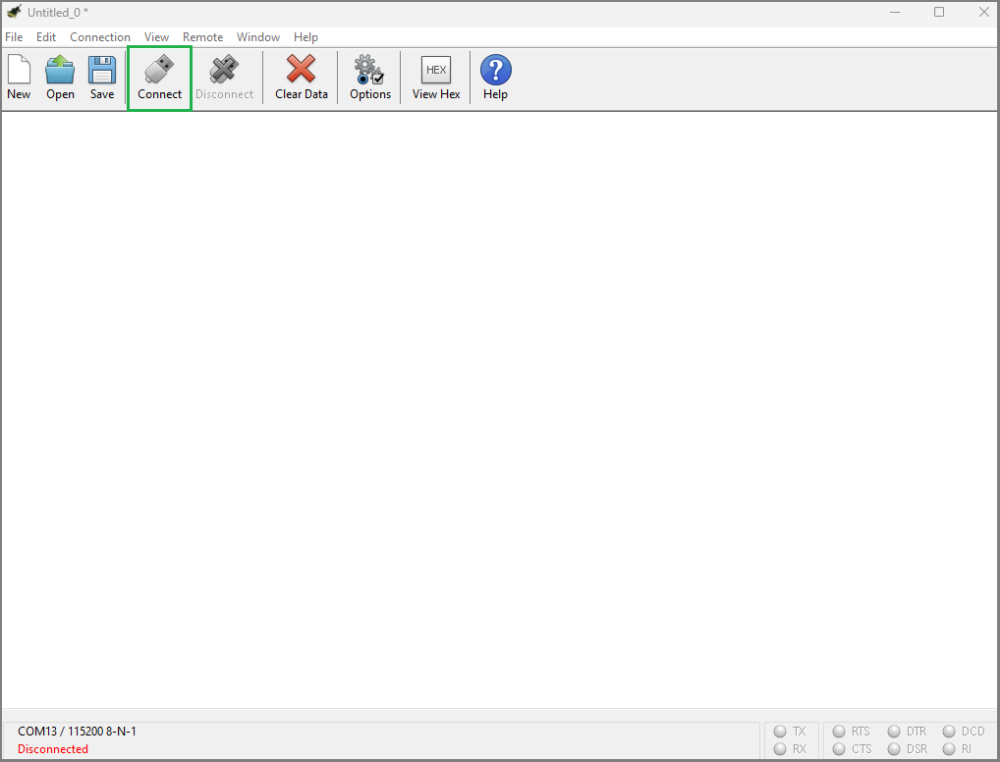
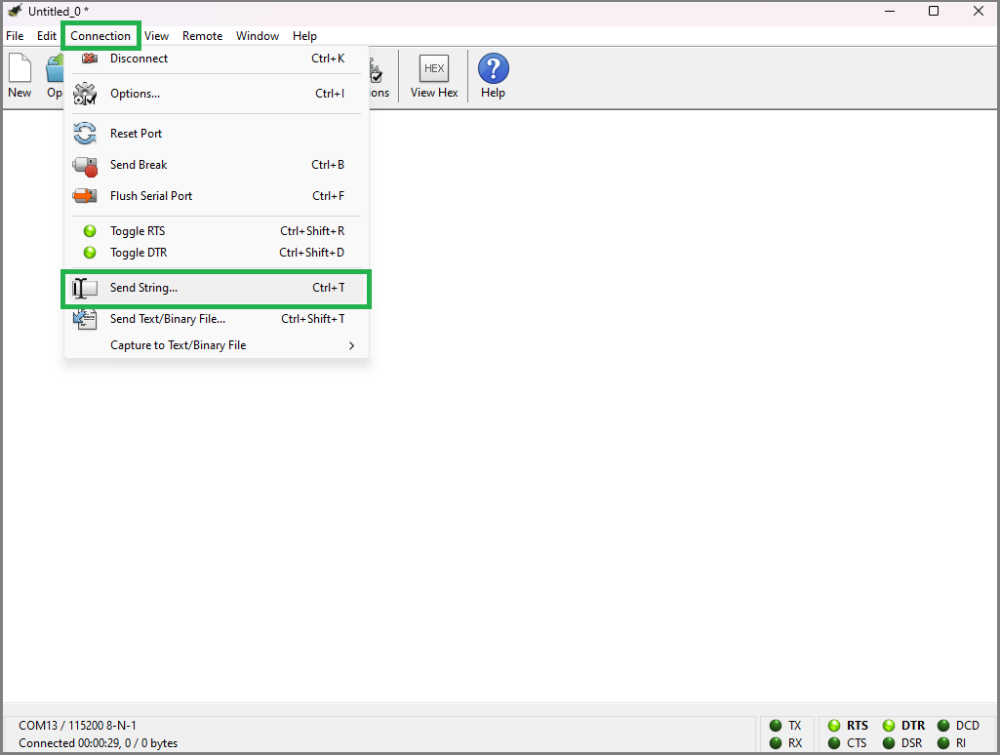
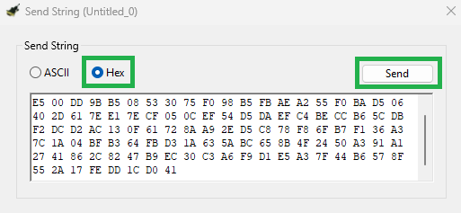
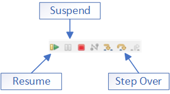
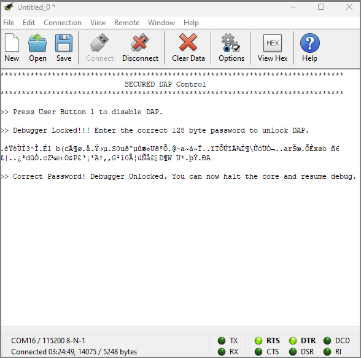
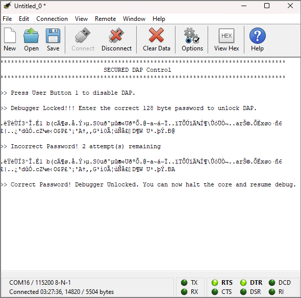
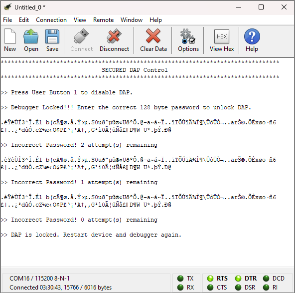

# SECURED DAP Control

**This code example illustrates the imitation of temporarily disabling the debug access port (DAP) and enabling DAP after successful RSA signature verification of the password using the crypto module.**

## Device

The device used in this code example (CE) is:
- [TRAVEO™ T2G CYT4BF Series](https://www.infineon.com/cms/en/product/microcontroller/32-bit-traveo-t2g-arm-cortex-microcontroller/32-bit-traveo-t2g-arm-cortex-for-body/traveo-t2g-cyt4bf-series/)

## Board

The board used for testing is:
- TRAVEO™ T2G evaluation kit ([KIT_T2G-B-H_LITE](https://www.infineon.com/cms/en/product/evaluation-boards/kit_t2g-b-h_lite/))

## Scope of work

In this CE, we configure T2G's access port control register (CPUSS_AP_CTL) to temporarily disable and enable DAP upon successful password verification. Generally, during the NORMAL_PROVISIONED life-cycle stage, access restrictions for DAP are implemented by writing into the NORMAL access restriction (NAR) row in supervisory flash (SFlash). Then the ROM/flash boot reads from the SFlash and configures CPUSS_AP_CTL register accordingly. However, the access restrictions in NAR cannot be widened to lower the existing restrictions. Thus, to avoid permanently locking of the DAPs, we control the access ports (APs) by temporarily writing the CPUSS_AP_CTL register.

To disable the APs, the user can press User Button 1. The interrupt triggered will disable the APs and the debugger connection is lost. Once the user sends the correct signature of the password based on RSA over UART, the APs are enabled and debugging can be resumed. If a wrong password signature is sent 3 times, then the APs are never re-enabled and debugging of the cores is not possible until the device is reset.

## Introduction
**DAP**

DAP acts as the program and debug interface. This allows the connection to the three access ports: CM0_AP, CM7_AP, and System_AP. The external programmer or debugger, also known as the 'host', communicates with the DAP using either the Serial Wire Debug (SWD) or Joint Test Action Group (JTAG) interface.
The DAP also includes the SWD listener which decides if the JTAG interface (default) or SWD interface is active. Note that JTAG and SWD are mutually exclusive because they share pins. The debug port connects to the DAP bus, which in turn connects to one of the three APs.

This CE works with SWD interface and all the APs will be enabled or temporarily disabled.

**Debug access restrictions**

This determines the debug port access restrictions and has three states corresponding to the protection state: NORMAL, SECURE, and DEAD. This code example focuses on imitating NORMAL access restrictions stored in SFlash.
This restriction is written in row 13 of the SFlash. The access restrictions are encoded with a 'Disable' bit and an 'Enable' bit as follows:
- Enable AP - 00
- Disable (temporarily) AP - 01
- Permanently Disable AP - 1x

Here, the Disable bit has a higher priority than the Enable bit. The Boot applies the value of Disable bit and inverse value of the Enable bit. Therefore, '01' corresponds to Disable Bit = 0 and Enable Bit = 0.

When NORMAL access restrictions are requested to be updated and if the new restrictions are wider than the existing ones, this request will be invalid. For instance, if row 13 was written with 'Disable AP', it cannot be updated to 'Enable AP'. An AP that is permanently disabled,  cannot be re-enabled.
This could lead to permanent locking of the device.

Alternatively, instead of the BOOT applying the NAR configuration, the CPU's access port control register (CPUSS_AP_CTL) can be written through a program to control the APs. This register enables individual APs. Typically, this field is set by the boot code with information from the NAR SFlash row (in NORMAL_PROVISIONED lifecycle stage).
To enable the following APs, the register bits should be as follows:
- System AP -  SYS_DISABLE bit is '0' and SYS_ENABLE bit is '1'
- CM7_0 and CM7_1 AP - CM7_DISABLE is bit '0' and CM7_ENABLE bit is '1'
- CM0 AP - CM0_DISABLE bit is '0' and CM0_ENABLE bit is '1'

This CE will disable and enable all the above APs.

**Cryptography block**

The cryptography function block of TRAVEO™ T2G supports Secure Hash Algorithm (SHA). This functionality produces a fixed-length hash (also called 'message digest') of up to 512 bits from a variable-length input data (called 'message').

In this CE, SHA functionality is used to verify the password sent by the user over UART. Asymmetric cryptography is implemented where the sender generates a digital signature of a message using its private key and any receiver can verify this message by using the sender’s public key or vice versa.
A popular asymmetric cryptography algorithm is RSA, which is supported by the crypto driver.

Terminologies to be noted:
- **Plaintext** - An unencrypted message.
- **Digital digest/signature** - Signature generated by SHA-256 function that operates on a block of data.
- **Hash** - A crypto algorithm that generates a repeatable but unique digest for a given block of data. SHA is used to derive a hash value from a user password.
- **SHA-256** - A cryptographic hash algorithm used to create a digest for a block of data or code. This hash algorithm produces a 256-bit unique digest of the data no matter the size of the data block.

The encrypted signature is created by computing the hash of the plaintext and then encrypting it with a private key. This encrypted signature is stored in *Password_Signature.txt*.
Encrypted Digital Signature is decrypted using the public key, to reveal the decrypted digital signature.
The calculated digital digest and the decrypted digital digest (signature) are then checked for an exact match. If they are an exact match, the password is verified.

More details can be found in [Technical Reference Manual (TRM)](https://www.infineon.com/dgdl/?fileId=5546d4627600a6bc017600bfae720007), [Registers TRM](https://www.infineon.com/dgdl/?fileId=5546d4627600a6bc017600be2aef0004) and [Data Sheet](https://www.infineon.com/dgdl/?fileId=5546d46275b79adb0175dc8387f93228).

## Hardware setup

This CE has been developed for:
- TRAVEO™ T2G evaluation kit lite ([KIT_T2G-B-H_LITE](https://www.infineon.com/cms/en/product/evaluation-boards/kit_t2g-b-h_lite/)) 
 
No changes are required from the board's default settings.

A UART serial connection should be made with the computer via the serial port (KitProg3 connector). Use [CoolTerm](https://download.cnet.com/coolterm/3000-2094_4-10915882.html?ex=BER-1278.2) terminal application to see the output on the screen.

## Implementation

In this CE, the device life-cycle stage is NORMAL_PROVISIONED. The program toggles user LED and waits for an interrupt triggered by the user button event. The interrupt handler will disable the access ports and stops toggling the user LED. When the correct password signature is sent over UART and verified by the program, the program will enable the APs and LED will resume toggling.

**STDOUT/STDIN setting**

Initialization of the GPIO for UART is done in the <a href="https://infineon.github.io/retarget-io/html/group__group__board__libs.html#gaddff65f18135a8491811ee3886e69707"><i>cy_retarget_io_init()</i></a> function.
- Initializes the pin specified by *CYBSP_DEBUG_UART_TX* as UART TX and the pin specified by *CYBSP_DEBUG_UART_RX* as UART RX (these pins are connected to KitProg3 COM port)
- The serial port parameters are 8N1 and 115200 baud

**GPIO pin configuration**

The GPIO port address is calculated based on the port number through <a href="https://infineon.github.io/mtb-pdl-cat1/pdl_api_reference_manual/html/group__group__gpio__functions__init.html#gab0eeafea970eadb4e147ff6d0e3804dc"><i>Cy_GPIO_PortToAddr()</i></a>. This data is later used for initialization of GPIO pins.

The GPIO pins are initialized using <a href="https://infineon.github.io/mtb-pdl-cat1/pdl_api_reference_manual/html/group__group__gpio__functions__init.html#gaf57c501727276013d3e8974a9fb7d0a7"><i>Cy_GPIO_Pin_FastInit()</i></a>. User LED (USER LED 1) is configured to output mode. The active-low GPIO pin toggles when the APs are enabled.

User button 1 is configured to input mode. It is also associated with an interrupt handler - *handleGPIOinterrupt*, which is triggered when the button is pressed. The interrupt is set on the falling edge of the signal via <a href="https://infineon.github.io/mtb-pdl-cat1/pdl_api_reference_manual/html/group__group__gpio__functions__interrupt.html#gacbd69c3618483865a278e7dbd3f6dc78"><i>Cy_GPIO_SetInterruptEdge()</i></a> and configures the pin interrupt to be forwarded to CPU using <a href="https://infineon.github.io/mtb-pdl-cat1/pdl_api_reference_manual/html/group__group__gpio__functions__interrupt.html#ga0a32bd22c79ffcea82ce97ac73d1a6da"><i>Cy_GPIO_SetInterruptMask()</i></a>.The interrupt is initialized with its interrupt handler through <a href="https://infineon.github.io/mtb-pdl-cat1/pdl_api_reference_manual/html/group__group__sysint__functions.html#gab2ff6820a898e9af3f780000054eea5d"><i>Cy_SysInt_Init()</i></a>.

**Crypto initialization**

The crypto hardware block is enabled by calling <a href="https://infineon.github.io/mtb-pdl-cat1/pdl_api_reference_manual/html/group__group__crypto__lld__hw__functions.html#ga6aede3754a84e01d5e9b4227a683c24c"><i>Cy_Crypto_Core_Enable()</i></a>.
As the crypto functions, used in this CE, treat data (such as message or key) in little endian format, <a href="https://infineon.github.io/mtb-pdl-cat1/pdl_api_reference_manual/html/group__group__crypto__cli__functions.html#gabd4ba58c8fef2e5dc952995774cfb760"><i>Cy_Crypto_InvertEndianness()</i></a> inverts the endianness.

**User input**

When the user button is pressed, the program waits for an input - the password to unlock DAP.
Using UART serial communication, the user can input password on CoolTerm terminal.

**Code example main loop**

The endless loop of the CE in *main()* always toggles the LED by calling <a href="https://infineon.github.io/mtb-pdl-cat1/pdl_api_reference_manual/html/group__group__gpio__functions__gpio.html#ga449eb0f5c040b99aec41b81da2e9c71f"><i>Cy_GPIO_Inv()</i></a> until the user button is pressed. When the button is pressed, *checkUARTpassword()* is called.

**Password check**

The *handleGPIOinterrupt()* function is called when the user button is pressed. The APs are disabled and the LED is turned off via <a href="https://infineon.github.io/mtb-pdl-cat1/pdl_api_reference_manual/html/group__group__gpio__functions__gpio.html#ga196dd5733c39fbc9a3901464e8420eea"><i>Cy_GPIO_Write()</i></a>. The handler also clears the triggered interrupt though <a href="https://infineon.github.io/mtb-pdl-cat1/pdl_api_reference_manual/html/group__group__gpio__functions__interrupt.html#gaae0b45e44224b8387f5e3deb8f671a1d"><i>Cy_GPIO_ClearInterrupt()</i></a>.

Then, *checkUARTpassword()* checks whether a character has been received from the user via UART (terminal) using <a href="https://infineon.github.io/mtb-hal-cat1/html/group__group__hal__uart.html#ga89108b2d339dc9863ec660588e3a4a12"><i>cyhal_uart_getc()</i></a>.
The character recieved will be displayed on the terminal using <a href="https://infineon.github.io/mtb-hal-cat1/html/group__group__hal__uart.html#ga2184202b0b3995fcf625caf9f8c3dc05"><i>cyhal_uart_putc()</i></a>.
When *PASSWORD_SIGNATURE_SIZE* (128) bytes are received, signature decryption and verification is performed. However, if incorrect password is sent *MAX_PASSWORD_CHECK* times, the button interrupt is disabled. This mimics the locking of the device and the user should reset the device and the debugger to start the test again.

**Password verification**

*verifyRSAsignature()* verifies the password.

To verify the RSA signature, the following steps are done:
1. The RSA public key structure *PUBLIC_KEY* is assigned with the RSA public key data, which includes the modulus and the exponent part.
2. SHA Hash function - <a href="https://infineon.github.io/mtb-pdl-cat1/pdl_api_reference_manual/html/group__group__crypto__lld__sha__functions.html#ga3023d5535203528b0ef7136c86f8a66c"><i>Cy_Crypto_Core_Sha()</i></a> is performed to calculate SHA digest.
3. The encrypted signature is decrypted using <a href="https://infineon.github.io/mtb-pdl-cat1/pdl_api_reference_manual/html/group__group__crypto__lld__asymmetric__functions.html#gae83f35c8c5a35e9b7321ada249d40d95"><i>Cy_Crypto_Core_Rsa_Proc()</i></a>.
4. Finally, the decrypted signature is verified with the calculated SHA digest using <a href="https://infineon.github.io/mtb-pdl-cat1/pdl_api_reference_manual/html/group__group__crypto__lld__asymmetric__functions.html#gae8aee459272ad30568e9c13a4c5dc729"><i>Cy_Crypto_Core_Rsa_Verify()</i></a>.

If the password is a match, the APs are enabled.

## Run and Test

For this CE, CoolTerm terminal is required for displaying outputs and to send data over UART. Install [CoolTerm](https://download.cnet.com/coolterm/3000-2094_4-10915882.html?ex=BER-1278.2) as instructions in this document is based on this terminal application.

After code compilation, perform the following steps for flashing the device:
1. Connect the board to your PC using the provided USB cable through the KitProg3 USB connector.
2. Open CoolTerm and click on **Options**. Choose the correct KitProg COM port under **Port** and **Baudrate** to 115200. To apply the changes, click on **OK**.

   *Figure 1. CoolTerm Options Configuration* 

3. Click on **Connect** to connect to the COM port.

   *Figure 2. CoolTerm connect to COM Port* 

4. To program the board:
    - Select the code example project in the Project Explorer.
    - In the **Quick Panel**, scroll down, and click **[Project Name] Program (KitProg3_MiniProg4)**.

5. As this CE requires debugging to verify the test steps, you can debug the example to step through the code. In the IDE, use the **[Project Name] Debug (KitProg3_MiniProg4)** configuration in the **Quick Panel**. For details, see the "Program and debug" section in the [Eclipse IDE for ModusToolbox™ software user guide](https://www.infineon.com/dgdl/Infineon-ModusToolbox_3.2_b_Eclipse_IDE_User_Guide-UserManual-v01_00-EN.pdf?fileId=8ac78c8c8d2fe47b018e0ea1b42078f2).
6. On the UART terminal, a message will be displayed to press User Button 1. The user can press the user button and the user will be prompted to send the password to unlock DAP.
7. To send the password over UART, click on **Connection** and then **Send String**.

   *Figure 3. CoolTerm Send String* 

8. Check the radio button **Hex** and enter/paste the password in the box. Then click **Send**.

   *Figure 4. CoolTerm Send String in Hex* 

9. **Debugging procedure**: The following debugging features are used in the order mentioned below, to test the behaviour:

   *Figure 5. IDE Debug Features* 

    - **Resume** the program if it not already running
    - **Suspend** the program
    - **Step Over** a few times
    - **Resume** the program if stepping over is possible (the current debug instruction pointer will step over to the next instruction). Debugging is considered possible if stepping over is possible. (Please read Note 1)

**Note 1:** While trying to use the debug features after unlocking DAP, it is possible that an error message (such as 'Interrupt failed') might appear. If that is the case:
- Terminate the debug session (if not terminated)
- Go to the Menu bar and click on **Run**->**Debug Configurations..**
- Select **[Project Name] Attach (KitProg3_MiniProg4)** and click on **Debug**
- Continue with the debugging procedure as mentioned above

**Note 2:** If Tera Term terminal is used, the password can be sent through UART by sending a binary file, named *Password_Signature.bin*.

**Note 3:** **(Only while debugging)** On the CM7 CPU, some code in *main()* may execute before the debugger halts at the beginning of *main()*. This means that some code executes twice: once before the debugger stops execution, and again after the debugger resets the program counter to the beginning of *main()*. See [KBA231071](https://community.cypress.com/docs/DOC-21143) to learn about this and for the workaround.

**Expected behavior**

To demonstrate DAP control, ensure the program is run in debug mode to verify the possibility of debugging when APs are disabled.

- **Test 1: Verification with Correct Password**
    1. User LED is toggling. Execute the debugging procedure (in mentioned order). Debugging is possible.
    2. Press User Button 1 to disable the APs. The LED stops toggling. Execute the debugging procedure. Debugging is not possible.
    3. Send the correct password (128 bytes) through UART. The correct password is stored in *Password_Signature.txt*.
    4. UART terminal displays status of password verification. In this case, 'Correct Password'. LED resumes toggling.
    5. Execute the debugging procedure. Debugging is possible. 
    *Figure 6. Terminal display for verification with correct password* 

- **Test 2: Verification with Incorrect Password**
    1. User LED is toggling. Execute the debugging procedure. Debugging is possible.
    2. Press User Button 1 to disable the APs. The LED stops toggling. Execute the debugging procedure. Debugging is not possible.
    3. Send an incorrect password (128 bytes) through UART.
    4. UART terminal displays status of password verification. In this case, 'Incorrect Password'. LED won't resume toggling.
    5. Send the correct password (128 bytes) through UART. The correct password is stored in *Password_Signature.txt*.
    6. UART terminal displays 'Correct Password'. LED resumes toggling.
    7. Execute the debugging procedure. Debugging is possible. 
    *Figure 7. Terminal display for verification with incorrect password* 

- **Test 3: Incorrect Password sent Maximum Times**
    1. User LED is toggling. Execute the debugging procedure. Debugging is possible.
    2. Press User Button 1 to disable the APs. The LED stops toggling. Execute the debugging procedure. Debugging is not possible.
    3. Send an incorrect password (128 bytes) through UART thrice. In this CE, maximum limit is thrice.
    4. UART terminal displays status of password verification. In all the cases, 'Incorrect Password' will be displayed. LED won't resume toggling.
    5. Reset the device and debug mode on IDE again to repeat any other tests. 
    *Figure 8. Incorrect Password sent Maximum Times* 

## References

Relevant Application notes are:
- [AN235305](https://www.infineon.com/dgdl/Infineon-AN235305_GETTING_STARTED_WITH_TRAVEO_TM_T2G_FAMILY_MCUS_IN_MODUSTOOLBOX_TM-ApplicationNotes-v05_00-EN.pdf?fileId=8ac78c8c8b6555fe018c1fddd8a72801) - GETTING STARTED WITH TRAVEO™ T2G FAMILY MCUS IN MODUSTOOLBOX™
- [AN228680](https://www.infineon.com/dgdl/Infineon-AN228680_-_Secure_system_configuration_in_TRAVEO_TM_T2G_family-ApplicationNotes-v07_00-EN.pdf?fileId=8ac78c8c7cdc391c017d0d3e888b67e2) - Secure system configuration in TRAVEO™ T2G family
- [AN220253](https://www.infineon.com/dgdl/Infineon-AN220253_-_Using_the_CRYPTO_module_in_TRAVEO_T2G_family-ApplicationNotes-v03_00-EN.pdf?fileId=8ac78c8c7cdc391c017d0d3b144c679e) - Using the CRYPTO module in TRAVEO™ T2G family

ModusToolbox™ is available online:
- <https://www.infineon.com/modustoolbox>

Associated TRAVEO™ T2G MCUs can be found on:
- <https://www.infineon.com/cms/en/product/microcontroller/32-bit-traveo-t2g-arm-cortex-microcontroller/>

More code examples can be found on the GIT repository:
- [TRAVEO™ T2G Code examples](https://github.com/orgs/Infineon/repositories?q=mtb-t2g-&type=all&language=&sort=)

For additional training, visit our webpage:
- [TRAVEO™ T2G training](https://www.infineon.com/cms/en/product/microcontroller/32-bit-traveo-t2g-arm-cortex-microcontroller/32-bit-traveo-t2g-arm-cortex-for-body/traveo-t2g-cyt4bf-series/#!trainings)

For questions and support, use the TRAVEO™ T2G Forum:
- <https://community.infineon.com/t5/TRAVEO-T2G/bd-p/TraveoII>
